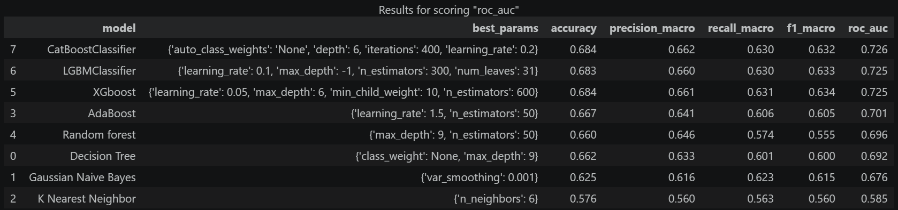
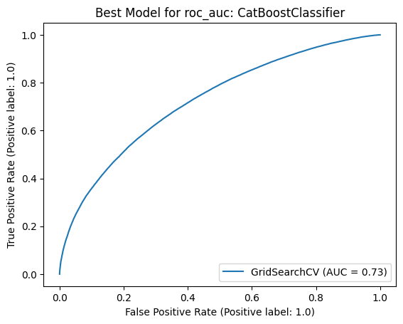
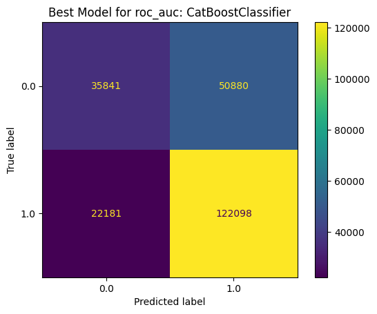

# 🩺 Sansone-Diabetes-Prediction-Challenge

## Project Overview
This project is part of the **2025 Kaggle Playground Series**, specifically Season 5, Episode 12 ([link](https://www.kaggle.com/competitions/playground-series-s5e12)). The goal of this competition is to leverage machine learning techniques to predict the probability that a patient will be diagnosed with diabetes based on various clinical and demographic features.

## Dataset
The dataset provided for this challenge is **synthetically generated** from real-world data, ensuring a balance between realistic feature relationships and the security of test labels.
The dataset for this competition (both train and test) was generated from a deep learning model trained on the Diabetes Health Indicators Dataset. Feature distributions are close to, but not exactly the same, as the original. 

The target is *diagnosed_diabetes* and for the testing data you should predict the probability of *diagnosed_diabetes*.

You can download the dataset from this repository (*dataset* directory) or [here](https://www.kaggle.com/competitions/playground-series-s5e12/data) (official page of the competition)

## Objectives
- **Predictive Modeling:** Build a robust binary classification model to estimate the probability of a diabetes diagnosis.
- **Skill Development:** Practice tabular data processing, feature engineering, and hyperparameter tuning.
- **Performance Optimization:** Maximize the model's performance as measured by the ROC AUC metric.

## Evaluation Metric
Submissions are evaluated based on the **Area Under the ROC Curve (AUC-ROC)** between the predicted probability and the observed target.

## Modeling Approach
The problem is framed as a binary classification task, optimized for ROC-AUC. After exploratory analysis, cleaning and preprocessing, eight different classifiers were trained and compared:
- Decision Tree
- Gaussian Naive Bayes
- K-Nearest Neighbors
- AdaBoost
- Random Forest
- XGBoost
- LightGBM
- CatBoost

Each model was tuned through GridSearchCV using a 5-fold Stratified K-Fold cross-validation on the training set, with roc_auc as the optimization metric. After tuning, every model was evaluated once on an isolated hold-out test set (~67% / 33% split) to obtain an unbiased estimate of its real performance.

  

## Results
The three boosting models (CatBoost, LightGBM, XGBoost) clearly outperform every other approach and cluster tightly together around 0.725–0.726 ROC-AUC.
The best estimator is the **CatBoostClassifier** with {depth: 6, iterations: 400, learning_rate: 0.2, auto_class_weights: None}, reaching a ROC-AUC of 0.726 on the unseen test set.

 
   

## How to Run the Notebook
The notebook is designed to run on **Kaggle** using the **CPU**.

1. Upload the notebook to Kaggle.
2. Make sure the accelerator is set to **CPU** (None) in the session settings.
3. To execute the entire notebook, use **Save & Run All (commit)**.

Running the notebook via **Save & Run All (commit)** starts the execution in the background, ensuring that it runs to completion even if you close the browser. This avoids the typical problems of the interactive session (inactivity timeouts, disconnections, interrupted runs). This type of running is useful especially for the grid search section because it takes a lot of time. If you are just interested in the analysis part the interactive mode is fine too. 
